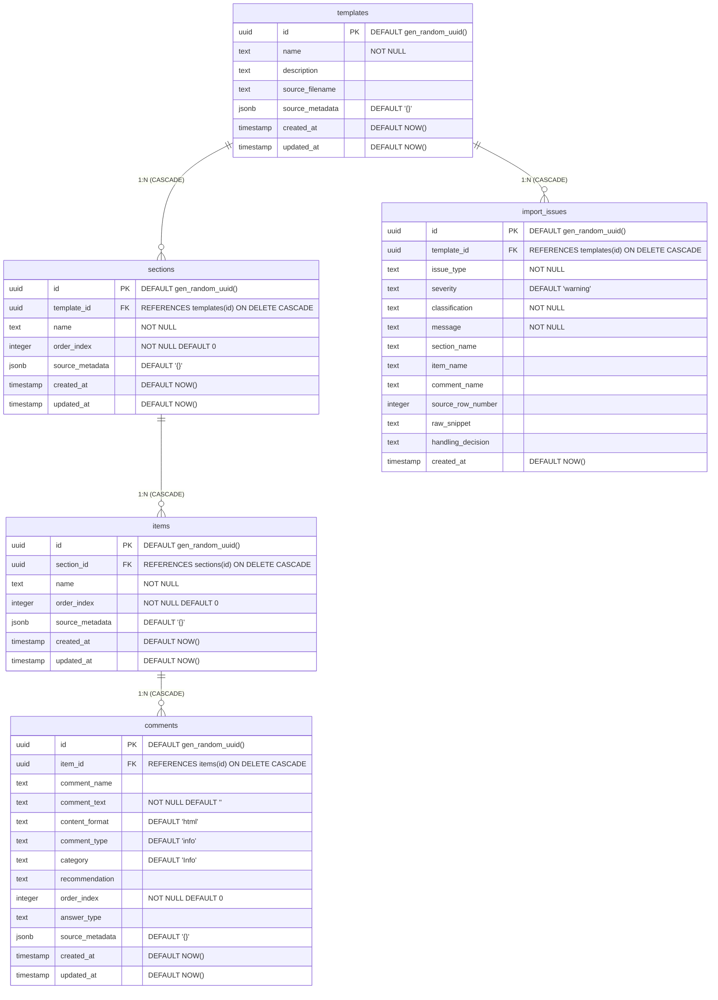

# Hive Inspect — System Architecture & Design Specification

> **Historical Design Document — implementation diverged during development:**
> Initial architectural planning originally proposed Prisma ORM, Cheerio HTML parsing, and CUID keys. During development, the architecture deliberately diverged to pure Node.js `zlib` (to decompress OpenXML `.xls` / `.xlsx` archives without heavy native C++ binaries or Vercel edge runtime failures), standard PostgreSQL UUIDs (`gen_random_uuid()`), and a Supabase client paired with direct `pg` connection pooling (port `6543`) for atomic multi-row ACID transactions. This document details both the historical design considerations and the final production-grade implementation.

---

## 1. System Overview & Architectural Goals

Hive Inspect is a production-grade template ingestion and editing web application designed to solve the critical problem of **home inspector template migration**:

1. **Zero Data Loss:** Faithful ingestion of Spectora's 42-column OpenXML spreadsheet exports (`.xls` / `.xlsx`) into a normalized relational model rather than an opaque HTML blob.
2. **Transparent Preservation Audit:** Factual counts and classified diagnostic warnings via the built-in **Import Preservation & Confidence Report** (zero invented percentages).
3. **Desktop Workspace Ergonomics:** Dual-pane hierarchical editor with independent panel scrolling, smart auto-flipping classification popovers, and sticky top action bars.
4. **ACID Transactional Integrity:** Atomic batch-updates with complete rollback on partial failure, preventing corrupted half-saved templates.
5. **Decoupled Template Duplication:** Deep recursive cloning with independent primary and foreign keys, ensuring clones never mutate originals.

---

## 2. Architecture & Technology Stack

```
+-----------------------------------------------------------------------+
|                              Client Browser                           |
|     Next.js 14 App Router, React 18, Tailwind CSS, Lucide Icons       |
+-----------------------------------+-----------------------------------+
                                    |
                    HTTPS / REST API Route Handlers
                                    |
+-----------------------------------v-----------------------------------+
|                        Next.js Server Runtime                         |
|   +---------------------------------------------------------------+   |
|   |  Ingestion Pipeline (src/services/spectoraImporter.ts)        |   |
|   |  - Pure Node.js zlib OpenXML ZIP Decompressor                 |   |
|   |  - SharedStrings Dictionary & Sheet XML Cell Extractor        |   |
|   |  - 42-Column Relational Mapping & Tag Sanitizer               |   |
|   +---------------------------------------------------------------+   |
|   |  Audit & Diagnostics (src/features/importer/audit/)           |   |
|   |  - Deterministic Confidence Report Builder                    |   |
|   |  - Warning Categorization & Itemized Issue Tracker            |   |
|   +---------------------------------------------------------------+   |
|   |  Relational Data Layer (src/db/)                              |   |
|   |  - Supabase Client (@supabase/supabase-js)                    |   |
|   |  - Direct PostgreSQL Pooler (pg) with Atomic Transactions     |   |
|   |  - In-Memory Fallback Driver with Snapshot Rollback           |   |
|   +-------------------------------+-------------------------------+   |
+-----------------------------------|-----------------------------------+
                                    |
+-----------------------------------v-----------------------------------+
|                   Persistent Relational Database                      |
|                     (PostgreSQL via Supabase)                         |
|    UUID Keys (gen_random_uuid) · ON DELETE CASCADE · JSONB Metadata   |
+-----------------------------------------------------------------------+
```

### Technology Selection Rationale

| Layer | Technology | Actual Implementation & Rationale |
| :--- | :--- | :--- |
| **Framework** | **Next.js 14 (App Router)** | Full-stack unified runtime, built-in API route handlers, server/client separation, edge-ready Vercel deployment. |
| **Language** | **TypeScript 5.6 (Strict)** | End-to-end type safety across domain entities, parser intermediate representations, and API payloads. |
| **Styling** | **Tailwind CSS + shadcn/ui tokens** | Utility-first styling with HSL design tokens, responsive breakpoints, and custom 6px desktop scrollbars. |
| **Decompression** | **Pure Node.js `zlib`** | Decompresses Spectora's OpenXML ZIP archives without native C++ binary dependencies, avoiding Vercel serverless build failures. |
| **HTML Sanitization** | **DOM & Regex Sanitizer** | Preserves safe inspection formatting (`<b>`, `<ul>`, `<ol>`, `<p>`, `<a>`) while eliminating active scripts (`<script>`, `<iframe>`, `on*` event handlers). |
| **Database** | **Supabase / PostgreSQL** | Relational integrity with foreign keys, `ON DELETE CASCADE`, composite indexes, and JSONB unstructured storage. |
| **Data Access** | **Supabase Client + `pg`** | Hybrid access: Supabase client for queries/mutations + direct `pg` connection on port `6543` for atomic multi-row `BEGIN/COMMIT/ROLLBACK` transactions. |
| **Validation** | **Zod 3.23** | Runtime schema enforcement for environment variables (`src/validation/env.ts`) and API payloads. |

---

## 3. Directory & Folder Structure

```
hiveinspect/
├── ARCHITECTURE.md                  # This technical design document
├── README.md                        # Production setup & deployment guide
├── NOTES.md                         # Engineering notes & architectural trade-offs
├── package.json                     # Dependencies & test scripts
├── tsconfig.json                    # Strict TypeScript configuration
├── next.config.mjs                  # Next.js configuration
├── supabase/
│   └── migrations/
│       └── 20260914000000_create_template_importer_schema.sql # PostgreSQL schema
├── fixtures/
│   ├── Residential Template-2026-09-14.xls   # Primary Spectora test fixture
│   └── seed_template.json           # Serialized template graph for instant seeding
├── docs/
│   └── spectora-import-format.md    # Reverse-engineered OpenXML & HTML specification
├── src/
│   ├── app/                         # Next.js App Router
│   │   ├── layout.tsx               # Root layout with persistent Navbar & Theme
│   │   ├── page.tsx                 # Overview landing page
│   │   ├── globals.css              # Custom scrollbars, reset, and design tokens
│   │   ├── error.tsx                # Error boundary with retry trigger
│   │   ├── loading.tsx              # Loading skeleton boundary
│   │   ├── not-found.tsx            # 404 handler
│   │   ├── templates/
│   │   │   ├── page.tsx             # Template dashboard (listing, duplicate, delete)
│   │   │   └── [id]/
│   │   │       └── page.tsx         # Two-column template editor workspace
│   │   └── api/
│   │       ├── import/route.ts      # Multipart/JSON file ingestion endpoint
│   │       └── templates/
│   │           ├── route.ts         # GET (list), POST (create)
│   │           └── [id]/
│   │               ├── route.ts     # GET (full graph), DELETE (cascade delete)
│   │               ├── duplicate/route.ts   # POST (deep relational clone)
│   │               └── batch-update/route.ts# POST (atomic multi-entity update)
│   ├── components/
│   │   ├── confidence/
│   │   │   └── ConfidenceReportView.tsx     # Preservation audit modal & summary
│   │   ├── layout/
│   │   │   ├── navbar.tsx           # Responsive navigation bar with mobile drawer
│   │   │   └── breadcrumbs.tsx      # Route breadcrumbs
│   │   ├── template/
│   │   │   └── CommentClassificationDropdown.tsx # Minimalist auto-flip dropdown
│   │   └── ui/                      # Button, Card, Badge, Toast primitives
│   ├── features/
│   │   └── importer/audit/
│   │       └── confidenceReportBuilder.ts   # Deterministic integrity audit builder
│   ├── services/
│   │   ├── templateImportService.ts # Ingestion orchestrator & issue collector
│   │   └── spectoraImporter.ts      # Pure Node.js OpenXML & HTML table parser
│   ├── db/
│   │   ├── client.ts                # Supabase client singleton & environment check
│   │   └── repositories/            # Relational repositories (Template, Section, Item, Comment)
│   ├── types/
│   │   ├── template.ts              # Core relational domain models
│   │   ├── importer.ts              # Parser intermediate representations
│   │   └── database.ts              # Raw SQL table row representations
│   ├── validation/
│   │   ├── env.ts                   # Supabase environment validator
│   │   └── template.ts              # Request payload schemas
│   └── utils/
│       └── sanitize.ts              # HTML tag sanitizer & text extraction
└── scripts/                         # CLI test suites, migration, and seed scripts
    ├── run_all_tests.js             # Master test suite runner
    ├── migrate.js                   # Direct PostgreSQL migration runner
    ├── seed.js                      # Database seed script
    └── test_*.js                    # Dedicated verification suites
```

---

## 4. Relational Database Schema & Entities

The template is decomposed into a 4-tier normalized relational structure with UUID primary keys, plus an auxiliary diagnostic issues table:



### Key Schema Characteristics:
1. **UUID Primary Keys:** Generated via `gen_random_uuid()`, eliminating single-point ID generation collisions across branches.
2. **Cascading Deletes:** Deleting a `template` automatically removes all associated `sections`, `items`, `comments`, and `import_issues` cleanly in a single transaction.
3. **Ordering Preservation:** `order_index` integers on sections, items, and comments ensure the template displays in the exact visual sequence of the source workbook.
4. **Extensible JSONB Storage:** `source_metadata` stores all 30+ non-relational Spectora columns (e.g. `default_location`, `default_unit_type`, `unit_type_options`) without bloating table columns or discarding data.

---

## 5. Ingestion Pipeline & Decompression

Spectora's export is a standard OpenXML ZIP archive containing XML worksheets:

```
[Uploaded .xls / .xlsx File]
              │
              ▼
[OpenXML ZIP Decompressor (pure Node.js zlib)]
   ├── xl/sharedStrings.xml  ──► Shared String Table (Index -> Value)
   └── xl/worksheets/sheet1.xml ──► Sheet Cells & Inline Values
              │
              ▼
[42-Column Normalizer & Row Mapper]
   ├── Section Detection (Col A) ──► sections table
   ├── Item Detection (Col B)    ──► items table
   └── Comment Detection (Col C) ──► comments table
              │
              ▼
[HTML Sanitization & Safety Gate]
   ├── Safe Formatting Preserved: <b>, <i>, <u>, <ul>, <ol>, <li>, <p>, <a>
   └── Dangerous Scripts Stripped: <script>, <iframe>, on* event handlers
              │
              ▼
[Diagnostics Collector (import_issues)]
   ├── Missing Parent -> Linked to safe fallback
   └── Unsafe Elements -> Flagged with explicit Handling Decision
              │
              ▼
[Atomic Database Persistence]
```

---

## 6. Transaction Engine & Failure Recovery

Batch-updates (`/api/templates/[id]/batch-update`) and deep cloning (`/api/templates/[id]/duplicate`) utilize dual-strategy persistence:

### Strategy A: Direct PostgreSQL ACID Transaction (`pg`)
- Connects directly to PostgreSQL connection pooler (`DATABASE_URL` on port `6543`).
- Executes `BEGIN`:
  - Updates template root.
  - Updates all modified sections and items.
  - Updates all modified comments (`comment_name`, `comment_text`, `comment_type`, `category`).
- If any operation fails, executes `ROLLBACK`, guaranteeing zero partial updates.
- Executes `COMMIT` only when 100% of entity updates succeed.

### Strategy B: In-Memory Snapshot Fallback
- For local unit tests or offline environments without active database credentials, creates an in-memory deep snapshot before mutations.
- If an error occurs, restores the snapshot immediately, preventing corrupted in-memory state.

---

## 7. Desktop Workspace Ergonomics

The Template Editor (`src/app/templates/[id]/page.tsx`) implements a desktop two-column split layout:

1. **Exact Viewport Calculation:**
   - Container locked to `md:h-[calc(100vh-175px)]`, subtracting navbar (`65px`), footer (`67px`), and paddings.
   - **Zero Body Scroll:** The outer browser window never triggers a scrollbar on desktop viewports.
2. **Independent Panel Scrolling:**
   - Left Hierarchy Tree: `flex-1 min-h-0 overflow-y-auto`.
   - Right Findings Pane: `h-full min-h-0 overflow-y-auto pr-2 pb-16`.
   - Both panels feature custom 6px rounded pill scrollbars (`globals.css`).
3. **Smart Auto-Flipping Dropdown (`CommentClassificationDropdown`):**
   - Automatically measures viewport space below the trigger button.
   - Flips upward (`bottom-full mb-1`) when close to the bottom edge, preventing clipping.
   - Minimalist single-line options with colored indicators: Defect, Safety Hazard, Recommendation, Limitation, Maintenance, Information.
